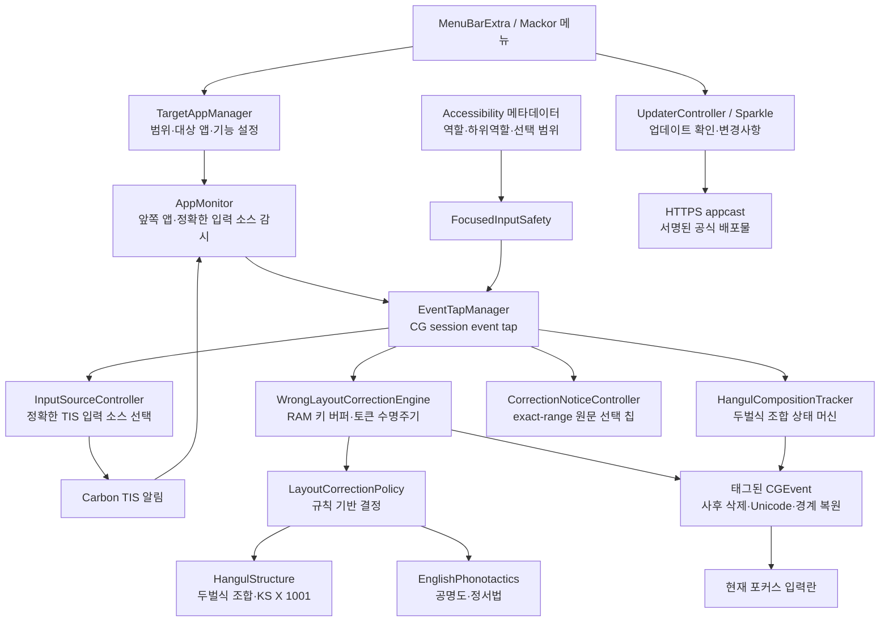

# Mackor 설계·원리·외부 검토 문서

> 대상 기준: Mackor 1.3 (빌드 9) 현재 작업 트리  
> 작성일: 2026-07-20 (최종 갱신 2026-07-22)
> 목적: 구현 의도, 실제 동작, 안전 경계, 검증 결과와 미해결 위험을 코드와 함께 외부 검토하기 위한 문서

이 문서는 제품 홍보문이 아니라 검토용 기준 문서다. 따라서 “의도한 동작”, “현재 코드로 확인된 동작”, “실제 macOS 환경에서 아직 확인해야 하는 동작”을 구분한다. 이 문서만 믿지 말고 반드시 같은 커밋의 소스와 테스트를 함께 대조해야 한다.

자동 한/영 오입력 판정과 제출 경계(Enter/Tab) 처리의 규범 문서는 [`STRUCTURE_CORRECTION_DESIGN4.md`](STRUCTURE_CORRECTION_DESIGN4.md)다 (v1.3에서 규칙 기반으로 전면 교체). 마침표 상태기계·원문 선택 UI 등 그 밖의 정책은 여전히 [`STRUCTURE_CORRECTION_DESIGN3.md`](STRUCTURE_CORRECTION_DESIGN3.md)를 따른다. 이 문서는 전체 제품 구조와 배포 경계를 설명하고, 세부 정책이 충돌하면 설계 문서와 같은 작업 트리의 테스트를 우선한다.

**문서 우선순위(2026-07-22).** 교정 방법론의 현행 최상위 문서는 [`CORRECTION_METHOD.md`](CORRECTION_METHOD.md)다. DESIGN4가 정의한 규칙 코어는 그대로 유효하고(R4-1 동결 대상), 그 위에 Layer 1 어휘 tiebreaker가 얹혀 있다. 세 문서가 충돌하면 `CORRECTION_METHOD.md` → `DESIGN4` → `DESIGN3` 순으로 읽는다.

## 1. 현재 결론

Mackor 1.3의 핵심 구조와 단위 테스트는 상당히 정리되었지만, 아직 “더 손댈 곳이 전혀 없는 완벽한 공개 배포판”이라고 판정할 수는 없다.

| 항목 | 현재 상태 | 공개 배포 판단 |
|---|---|---|
| 현재 소스 빌드 및 단위 테스트 | 2026-07-22 현재 213개 통과, 실패·건너뜀 0개 | 통과 |
| Xcode 정적 분석 | 현재 소스의 Release Analyze 통과 | 통과 |
| 자동 교정 판단 | DESIGN4 규칙 코어(문법 제약)로 판정하고, 규칙만으로 가릴 수 없는 경계는 Layer 1 고정 사전 tiebreaker가 결정 | 실험적 기능 |
| 실제 앱 종단간 입력 | 최신 설치본 교체 뒤 손쉬운 사용 권한 재연결이 필요하여 최종 실입력 확인 전 | 미완료 |
| 오픈소스 로컬 설치 경로 | `install.command`가 1.3 빌드 9를 빌드하고 로컬 Developer ID가 있으면 Hardened Runtime으로 재서명하며, 없으면 ad-hoc으로 통일한 뒤 앱·Sparkle 중첩 Mach-O의 Team ID와 strict 서명을 검사 | 로컬 테스트 전용 |
| 현재 로컬 updater | feed URL·Ed25519 공개키 미주입으로 의도적으로 비활성 | 로컬 테스트 전용 |
| 현재 `dist/` PKG·DMG 서명 | Mackor 1.3 로컬 개발용 산출물이며 ad-hoc 앱·미서명 PKG·미공증 DMG | 공개 배포 차단 |
| 1.3 공증·스테이플 | 현재 소스 기준 최종 산출물 승인·검증을 완료하지 않음 | 배포 차단 |

즉, 소스 수준의 자동화 검증은 통과했지만 실제 AX/CGEvent/TIS 통합 테스트와 새 배포물의 서명·공증 검증이 끝나야 공개 릴리스 후보가 된다.

## 2. 제품이 해결하는 두 문제

Mackor에는 서로 목적과 안전 경계가 다른 두 기능이 있다.

### 2.1 선택 앱 한글 조합 보정

CorelDRAW, Wine/CrossOver 앱, 일부 JCEF 영역처럼 macOS 한글 IME 조합을 제대로 처리하지 못하는 앱을 위한 기존 기능이다.

사용자가 등록한 앱이 앞에 있고, 그 앱의 `한글 조합 보정`이 켜져 있으며, 현재 입력 소스가 macOS 한국어 두벌식일 때 물리 키를 가로챈다. `HangulCompositionTracker`가 두벌식 자모를 완성형 유니코드로 조합하고, `EventTapManager`가 필요한 백스페이스와 결과 문자를 직접 주입한다.

이 기능은 일반 앱 전체의 IME를 개선하는 새 입력 소스나 시스템 확장이 아니다. 정상 IME 앱에 무분별하게 켜면 그 앱의 원래 조합 방식과 충돌할 수 있으므로 선택 앱에서만 동작한다.

### 2.2 한/영 오입력 자동 교정

사용자가 시스템 입력 소스를 바꾸지 않고 반대 자판으로 단어를 입력한 경우를 고친다. 관측 가능한 위험 문맥과 Latin-source 물리 ALL CAPS는 결정적으로 보존하고, 그 밖의 강한 구조 후보는 먼저 자동 보정한 뒤 가능한 입력란에서 짧은 원문 선택 기회를 제공한다.

예:

- ABC/U.S. 상태에서 `gksrmf ` 입력 → `한글 `로 교체 → 시스템 입력 소스를 한국어 두벌식으로 전환
- 한국어 두벌식 상태에서 `ㅗ디ㅣㅐ `에 해당하는 물리 키 입력 → `hello `로 교체 → 시스템 입력 소스를 ABC 또는 U.S.로 전환
- 한국어 두벌식 상태에서 `팿미 `에 해당하는 물리 키 `vocal` 입력 → 영어 구조가 성립하고 한글 구조가 무너지므로 `vocal `로 교체
- 후행 자모형 `해ㅐㅇ `에 해당하는 물리 키 `good` 입력 → 같은 구조 규칙으로 `good `으로 교체
- 완성형 한글 구조인 `재구/worn` → 현재 한국어 source 보존
- `dksehlsmsrjsep?` → `안되는건데?`
- `dkwn whgsp` → `아주 좋네`
- 숫자·지원 밖 기호가 섞인 run, ALL CAPS source, 양쪽이 모두 자연스러운 후보 → 변경하지 않음

위 단어들은 규칙을 검증하는 회귀 fixture이지 생산 코드의 전용 분기나 실행 중 순회하는 사례 목록이 아니다. 새 반례도 단어별 `if`로 추가하지 않고 일반 구조 규칙, `ambiguousBothValid` 전용 고정 어휘, 안전 gate를 수정해 해결한다.

이 기능은 맞춤법 교정, 문맥 이해, AI 번역이 아니다. 현재 단어의 제한된 물리 키 흐름으로 영문 후보와 두벌식 후보를 만들고, source 보호 규칙과 두 언어 구조 비용을 비교한다. 규칙이 양쪽을 모두 허용하는 일부 영문→한글 후보에만 버전·해시가 고정된 짧은 번들 사전을 사용하며 macOS 맞춤법·사용자 학습 사전에는 의존하지 않는다.

## 3. 명시적인 비목표

- 문장 전체를 읽거나 의미를 추론하지 않는다.
- 맞춤법, 띄어쓰기, 영문 오타를 고치지 않는다.
- 입력 보정에는 네트워크, 외부 AI/LLM, 유료 API 또는 사용자 API 키를 사용하지 않는다. 앱이 하는 네트워크 요청은 (1) 서명된 공식 업데이트 확인·다운로드와 (2) 운영자 공지 확인(`announcements.json`, appcast와 같은 GitHub Pages 호스트)뿐이며, 둘 다 식별자·추적이 없고 공지 확인은 설정의 `새 소식 확인`으로 끌 수 있다.
- 세벌식, Dvorak, Colemak, 사용자 정의 배열 또는 모든 언어 입력기를 지원하지 않는다.
- 앱별 설정을 웹사이트·탭·문서별 설정으로 세분화하지 않는다. 선택 모드에서 브라우저를 등록하면 브라우저 앱 전체가 한 대상이다.
- 단일 토큰만으로 사용자의 머릿속 의도를 100% 증명하는 것은 목표가 아니다. 승인된 중간 확신 후보를 먼저 적용하는 비용은 고정 코퍼스와 짧은 복구 UI로 측정한다.

## 4. 사용자에게 약속하는 모드 의미

`전체 Mac`과 `선택한 앱만`은 **자동 교정의 적용 범위**다. 기존 한글 조합 보정의 범위가 아니다.

| 동작 | 전체 Mac | 선택한 앱만 |
|---|---|---|
| 한/영 오입력 자동 교정 | 별도 앱 등록 없이 모든 앞쪽 앱의 안전한 일반 텍스트 필드 | 등록 앱 중 앱별 자동 교정을 켠 앱 |
| 기존 한글 조합 보정 | 등록 앱 중 앱별 조합 보정을 켠 앱 | 등록 앱 중 앱별 조합 보정을 켠 앱 |
| 대상 앱 목록·추가 UI | 조합 설정만 표시 | 조합·앱별 자동 교정 설정 표시 |
| 저장된 대상 앱 설정 | 조합 설정 사용, 앱별 자동 교정은 전역 범위가 대체 | 모두 사용 |
| 브라우저 | 모든 웹사이트에 같은 전역 정책 | 등록한 브라우저의 모든 웹사이트에 같은 앱 정책 |

전역 `Mackor 전체 활성화`가 꺼지거나 손쉬운 사용 권한이 없으면 두 기능 모두 중지한다.

새 앱의 안전한 기본값은 `한글 조합 보정 = 켬`, `자동 교정 = 끔`이다. 두 앱별 기능은 독립 설정이다. 자동 교정만 켜면 네이티브 IME 출력을 관찰하며, 조합 보정만 켜면 기존 직접 조합만 수행한다. 자동 교정 범위와 무관하게 등록 앱의 직접 조합 설정은 계속 적용된다.

기존 사용자에게 범위 값이 없거나 저장값이 손상된 경우 `선택한 앱만`으로 시작한다. 사용자가 대상 앱을 모두 지운 빈 목록은 유효한 선택으로 보존하며, 다음 실행에 알려진 앱을 다시 자동 추가하지 않는다.

실제 최초 실행에서 저장된 선택이 전혀 없을 때만 `/Applications`와 `~/Applications`를 제한적으로 탐색해 이름에 CorelDRAW 또는 IntelliJ 관련 키워드가 있는 앱을 대상 목록에 추가한다. 이 탐색 결과는 네트워크로 보내지 않지만, 설치된 앱 목록을 로컬에서 확인하는 동작 자체는 첫 실행 안내와 개인정보 검토 대상이다. CrossOver/Wine 런처처럼 화면의 앱과 실제 앞쪽 프로세스의 번들 ID가 다른 구조는 자동 감지 또는 대상 매칭이 실패할 수 있다.

## 5. 전체 구조



핵심 원칙은 판단, 조합, OS 입출력, 안전성 확인을 분리하는 것이다. 자동화 테스트에서는 실제 키보드와 AX를 건드리지 않도록 키 출력과 포커스 검사를 프로토콜 뒤에 두고 가짜 구현으로 이벤트 순서를 검증한다.

## 6. 구성 파일과 책임

| 파일 | 책임 |
|---|---|
| `MackorApp.swift` | 메뉴바 UI, 앱 수명 주기, 구성요소 연결, 권한 안내, 로그인 항목, 제거 UI |
| `TargetAppManager.swift` | 자동 교정 범위, 대상 앱 목록, 앱별 기능, UserDefaults 저장·마이그레이션 |
| `AppMonitor.swift` | 앞쪽 앱과 TIS 입력 소스 관찰, 두 기능의 활성 상태 계산, 입력 소스 전환 연결 |
| `EventTapManager.swift` | 전역 키·마우스 이벤트 처리, 교정 적용, Undo, 주입 이벤트 재진입 방지 |
| `FocusedInputSafety.swift` | 자동 교정 가능한 AX 텍스트 필드인지 fail-closed 판정, 동일 포커스·커서 확인 |
| `WrongLayoutCorrectionEngine.swift` | 물리 키 버퍼와 토큰 수명주기. 언어 판단은 하지 않는다 |
| `LayoutCorrectionPolicy.swift` | 규칙 기반 교정 결정(방향별 매트릭스, 신뢰 등급, 규칙 ID) |
| `HangulStructure.swift` | 두벌식 조합 결과의 한국어 구조 판정 |
| `EnglishPhonotactics.swift` | 영어 음소배열·정서법 판정과 위반 비용 |
| `KSX1001Table.swift` | 현대 한글 음절 2,350자 (EUC-KR 변환기에서 런타임 유도) |
| `InputSourceController.swift` | 지원 입력 소스 캐시·선택, 이전 소스 기록, 안전한 Undo 복원 |
| `HangulCompositionTracker.swift` | 초성·중성·종성 및 겹모음·겹받침 조합 상태 |
| `HangulUnicode.swift` | 완성형 한글 유니코드 조합·분해 보조 |
| `KeycodeToJamoMap.swift` | Apple QWERTY 물리 키코드를 두벌식 자모로 변환 |
| `CorrectionNoticeController.swift` | 교정된 exact range 위의 non-activating 원문-only 클릭 칩; 확신도별 4~6초 수명·hit-test |
| `SparkleUpdateConfiguration.swift` | HTTPS feed와 32바이트 EdDSA 공개키를 검증하고 미설정 개발 빌드를 비활성화 |
| `UpdaterController.swift` | Sparkle 표준 updater 수명, 메뉴 활성 상태, 수동 업데이트 확인 |
| `MackorTests/` | 순수 로직과 이벤트 흐름 단위 테스트 |
| `install.command` | GitHub 소스 ZIP을 압축 해제한 Xcode 사용자용 Finder 더블클릭 진입점 |
| `install.sh` | 현재 Mac의 `/Applications`에 로컬 Release 빌드 설치 |
| `build-installer.sh` | arm64+x86_64 앱, PKG, DMG, Sparkle ZIP, 선택적 Developer ID 서명·공증 |
| `scripts/prepare-appcast.sh` | 공증된 update ZIP과 릴리스 노트로 서명된 pending appcast 생성; 업로드는 하지 않음 |

## 7. 런타임 활성 조건

### 7.1 지원 입력 소스

정확한 TIS 입력 소스 ID가 다음 중 하나일 때만 자동 교정을 평가한다.

| 분류 | 입력 소스 ID |
|---|---|
| 한국어 | `com.apple.inputmethod.Korean.2SetKorean` |
| 영문 | `com.apple.keylayout.ABC` |
| 영문 | `com.apple.keylayout.US` |

표시 이름이나 “ASCII 가능” 여부만으로 비슷한 배열을 추정하지 않는다. 다른 입력 소스는 `.unsupported`로 처리하고 자동 교정 버퍼를 비운다.

### 7.2 상태 계산

직접 한글 조합은 다음을 모두 만족할 때 앱별 기능으로 활성화된다.

1. 전역 활성화가 켜져 있다.
2. 현재 앞쪽 앱이 등록 대상이다.
3. 그 앱의 조합 보정이 켜져 있다.
4. 입력 소스가 한국어 두벌식이다.
5. 손쉬운 사용 권한과 이벤트 탭이 유효하다.

자동 교정은 다음을 모두 만족할 때 관찰 상태가 된다.

1. 전역 활성화가 켜져 있다.
2. 현재 범위가 앞쪽 앱에 자동 교정을 허용한다.
3. 입력 소스가 위의 지원 목록에 있다.
4. 손쉬운 사용 권한과 이벤트 탭이 유효하다.

실제 토큰 기록과 교체에는 여기에 `FocusedInputSafety`의 필드별 확인이 추가된다.

## 8. 자동 교정 이벤트 흐름

### 8.1 영문 입력 소스에서 한글 의도를 입력한 경우

1. 지원 영문 소스에서 26개 QWERTY 글자 키 중 하나가 들어온다.
2. 처음 키에서 현재 AX 포커스가 안전한 일반 텍스트 필드인지 확인한다. AX 예산이 끝나면 키열만 RAM에 보존하고 다음 글자에서 남은 횟수로 다시 확인한다.
3. 글자 물리 이벤트는 앱에 그대로 전달하면서 키코드와 물리 Shift 상태만 RAM 버퍼에 넣는다. Caps Lock은 Latin 대소문자와 두벌식 물리 Shift를 한 값으로 안전하게 표현할 수 없어 해당 토큰을 보존한다.
4. 짧은 Latin 원문은 Space·`,`·`?`·`!` keyDown 안에서 exact text를 확인해 즉시 교정하고 합성 경계를 넣은 뒤 물리 경계 쌍을 억제한다. 그 밖의 경로는 keyDown을 통과시킨다. `.`은 1~3개까지 유예한다.
5. 지연 경로는 최종 trigger 경계의 keyUp 뒤 같은 안전한 AX 요소·캐럿과 exact 원문을 다시 확인한다.
6. 확인을 통과하면 앱이 이미 넣은 경계 배열을 뒤에서부터 지우고 원문을 지운 다음, 한글 Unicode 문자열과 동일 경계 배열을 순서대로 한 번 넣는다.
7. 시스템 입력 소스를 정확한 한국어 두벌식 ID로 바꾼다.
8. 6초 복원 트랜잭션을 만들고, 교정된 exact range의 문자열·좌표를 검증할 수 있으면 물리 키열로 재구성한 원문 하나만 확신도에 따라 4~6초 표시한다.

판단하지 못하거나 keyUp 시점의 포커스·커서 검증에 실패하면 글자와 경계의 물리 keyDown/keyUp이 모두 그대로 전달된 상태이므로 화면 내용은 바뀌지 않는다.

### 8.2 한국어 입력 소스에서 영문 의도를 입력한 경우

직접 조합을 켜지 않은 자동 교정 경로에서는 macOS 한국어 두벌식 IME가 원래 물리 키를 받아 화면의 한글 조합을 전담한다. Mackor은 같은 물리 키 흐름으로 원래 한글 후보와 대체 영문 후보를 재구성하고, 삭제 직전에는 캐럿 앞 exact 원문만 읽어 일치 여부를 확인한다. 주변 문장이나 필드 전체 값은 읽지 않는다.

1. 안전한 자동 교정 필드에서 글자 물리 keyDown/keyUp을 네이티브 IME에 그대로 보내면서 키코드와 Shift 상태를 기록한다.
2. macOS IME가 marked text와 완성 음절을 정상적으로 처리하며, 직접 조합이 꺼진 Mackor은 이를 가로채지 않는다.
3. 즉시 경계 keyDown 또는 마침표 유예 뒤 최종 trigger를 통과시켜 IME 조합과 경계 입력을 확정하고, 영문 후보가 로컬 판단 기준을 통과하면 보류 상태로 둔다.
4. 같은 최종 trigger keyUp 뒤 같은 안전한 AX 요소와 `원래 한글 UTF-16 길이 + BoundarySequence UTF-16 길이` 위치를 확인한다.
5. 확인을 통과하면 이미 입력된 경계 배열과 한글 원문을 지우고 영문 Unicode와 같은 경계 배열을 한 번 넣는다.
6. 마지막으로 이전에 사용했던 지원 영문 소스를 우선해 전환한다. 없으면 현재 ASCII 소스가 ABC/U.S.인지 확인한 뒤 ABC, U.S. 순으로 고른다.

직접 조합은 자동 교정 범위와 무관하게 사용자가 등록하고 조합 보정을 켠 앱에만 한정된다. 등록하지 않았거나 조합 보정을 끈 앱에서는 네이티브 IME를 유지한다.

### 8.3 등록 앱 직접 조합을 사용하는 경우

자동 교정이 꺼져 있어도 등록 앱의 조합 보정을 명시적으로 켜면 기존 방식으로 작동한다. 자모 키의 원래 이벤트를 막고 조합 상태 머신 결과를 Unicode로 보낸다. 방향키, Escape, 비자모 키 등에서는 진행 중 조합을 확정하거나 초기화하고 앱의 원래 이벤트를 통과시킨다. Return/Enter/Tab은 v1.3부터 제출 경계로도 쓰이므로 위 표를 따른다.

중요: 이 앱별 직접 조합 경로는 자동 교정용 `FocusedInputSafety` 판정과 별도의 기존 기능이다. 사용자가 등록 앱 전체에 명시적으로 켜는 기능이므로, 그 앱 안의 특수 필드에서도 직접 조합이 시도될 수 있다. 보안 필드까지 동일하게 제외해야 하는지는 외부 검토와 실제 앱 테스트가 필요한 항목이다.

## 9. 토큰 경계와 버퍼 규칙

| 입력 | 처리 |
|---|---|
| Space | Shift 유무와 관계없이 교정 경계; Shift 상태를 보존해 재주입 |
| `.` | 1~3개까지 후행 마침표로 유예; 다음 글자·숫자·내부 기호가 오면 전체 run 폐기, 4번째 마침표도 폐기 |
| `,` | Shift가 없을 때 교정 경계 |
| `?` | Shift+`/`일 때 교정 경계; Shift를 보존해 재주입 |
| `!` | Shift+`1`일 때 교정 경계; Shift를 보존해 재주입 |
| Return / 숫자패드 Enter / Tab | 제출 경계. 원문 8자 이하의 교정 후보가 있으면 키를 붙잡아 교정한 뒤 Shift 상태를 보존해 주입한다. 더 긴 후보와 후보 없음은 그대로 통과하며 `Shift+Tab`은 제외 |
| 방향키 / Escape | 위치가 달라질 수 있어 상태 초기화 후 통과 |
| Cmd / Ctrl / Option / Fn 조합 | 단축키를 건드리지 않고 상태 초기화 후 통과 |
| 숫자 또는 미지원 기호 | 토큰 전체를 다음 실제 경계까지 무효화 |
| Backspace | 유예 마침표부터 하나씩 제거한 뒤 유효 버퍼의 마지막 물리 키를 제거; 추적 불능이면 보수적으로 무효화 |
| Latin-source 물리 ALL CAPS 2자 이상 | target exact보다 먼저 원문 보존; 칩 없음 |
| 그 밖의 Shift 글자 토큰 | Shift를 두 후보에 그대로 반영; 2글자 이상이 모두 물리 Shift면 약어 규칙으로 보존 |
| Caps Lock이 들어간 글자 토큰 | Latin 대소문자와 두벌식 물리 Shift를 하나의 값으로 안전하게 재현할 수 없어 방향과 무관하게 토큰 전체를 보존 |
| 키 사이 2초 초과 | 긴 정지 전후를 한 단어로 보지 않고 해당 토큰을 경계까지 무효화 |
| 32키 초과 | 메모리 경계를 넘은 토큰 전체를 경계까지 무효화 |

미지원 입력 뒤의 사전 단어처럼 보이는 접미사만 따로 교정하지 않도록 `discardingUntilBoundary` 상태를 유지한다.

직접 조합, 성공한 자체 Undo, 짧은 Latin 즉시 교정 때문에 물리 keyDown을 막은 경우에는 짝이 되는 keyUp도 막는다. 지연 자동 교정의 최종 trigger keyDown과 keyUp은 통과시킨다. 후보는 `BoundarySequence.triggerKeycode`와 일치하는 keyUp까지만 보류하며, 그 전에 다른 keyDown이나 trigger autorepeat가 들어오면 늦은 교정을 막기 위해 폐기한다. 교정과 복원은 경계 배열을 뒤에서부터 삭제한 뒤 원문/결과를 바꾸고 같은 배열 순서로 경계를 재주입한다. 자체 Undo의 autorepeat keyDown은 물리 keyUp이 올 때까지 반복 실행하지 않는다. Mackor이 합성한 이벤트에는 `0x48474C46` 사용자 데이터 마커를 붙여 이벤트 탭이 다시 처리하지 않게 한다. 이 마커는 재진입 방지 장치이지 외부 프로세스를 인증하는 보안 경계는 아니다.

Unicode 주입 이벤트는 Quartz API 요구에 맞춰 더미 virtual keycode `0x09`를 만들고 `keyboardSetUnicodeString`으로 실제 문자를 덮어쓴다. 일반 텍스트 입력기는 Unicode 문자열을 소비하지만, 물리 keycode를 직접 읽는 게임 엔진, Wine 계층, 원격 입력기나 특수 편집기는 `0x09`를 별도 단축키로 해석할 가능성이 있다. 이는 실제 대상 앱별 검증이 필요한 호환성 경계다.

## 10. 교정 판단 알고리즘

### 10.1 저장 데이터

단어 하나를 처리하는 동안 다음만 RAM에 둔다.

- 최대 32개의 QWERTY 물리 키코드
- 각 키의 물리 Shift 상태. Caps Lock이 들어오면 해당 토큰은 경계까지 무효화
- 토큰이 시작된 지원 입력 소스 종류
- 마지막 키 입력 시각
- 교정이 실제 발생한 경우 Undo를 위해 원문·결과·경계와 포커스 토큰을 최대 6초

입력 필드의 값, 커서 앞뒤 문장과 클립보드는 읽지 않는다. 원문·결과 문자열은 저장된 필드 내용을 읽어서 얻는 것이 아니라 같은 물리 키 버퍼로 재구성하며, 교정하지 않은 토큰은 판단 즉시 버리고 교정 트랜잭션도 최대 6초 뒤 폐기한다.

### 10.2 후보 생성

같은 물리 키 배열로 두 후보를 만든다.

- 영문 후보: 고정 Apple QWERTY 키코드 표를 사용
- 한글 후보: `KeycodeToJamoMap`과 새 `HangulCompositionTracker`를 사용해 두벌식 완성형 구성

현재 입력 소스가 영문이면 화면의 원문 후보는 영문이고 대체 후보는 한글이다. 한국어이면 반대다.

### 10.3 길이와 신뢰도

현재 production 엔진에는 부동소수점 점수나 가산점 임계값이 없고, 승인 규칙 어느 것도 성립하지 않으면 source를 보존한다. 공통 우선순위는 다음과 같다.

1. 안전하지 않은 문맥과 지원 밖 run을 폐기한다.
2. Caps Lock이 관측된 토큰과 Latin source의 물리 ALL CAPS 2자 이상을 보존한다.
3. 두벌식·영어 두 문법의 충족 여부와 위반 비용을 비교해 방향별 교정 또는 보존 규칙을 고른다. 규칙 코어는 사전과 시스템 맞춤법 서비스를 참조하지 않는다.
4. Korean→Latin에서는 완전한 현대 한글, 전체 반복 자모, 자음 자모 나열을 먼저 보존하고 영어 구조가 성립하는 mixed/pure-jamo 후보만 교정한다.
5. Latin→Korean에서 두 문법이 모두 무결한 `ambiguousBothValid`만 고정된 번들 어휘로 한 번 더 판정한다. 한글 어휘만 있고 영어 어휘는 없을 때 교정하며 둘 다 있거나 자산을 읽지 못하면 보존한다.
6. 어떤 승인 규칙도 성립하지 않은 나머지는 이유 enum과 함께 source를 보존한다.

물리 Shift는 두벌식에서 다른 자모를 만들 수 있으므로 후보에 그대로 반영한다. 전대문자 토큰은 약어 표기 관례 규칙(R-D3)이 보존하며, Caps Lock은 두 언어의 의미를 한 값으로 재현할 수 없어 토큰 전체를 fail-closed로 보존한다. 판정 코어의 정밀도·재현율과 Python↔Swift 일치는 tune/holdout/golden 코퍼스로, 고정 어휘는 별도 parity와 체크섬으로 회귀 검증한다.

## 11. 포커스·보안 필드 안전 장치

자동 교정은 `FocusedInputSafety`가 토큰을 발급할 때만 시작한다.

### 11.1 허용 조건

- macOS Secure Event Input이 꺼져 있다.
- 현재 포커스 AX 요소를 읽을 수 있다.
- 역할이 `AXTextField`, `AXTextArea` 또는 `AXComboBox`다.
- 선택 범위를 읽을 수 있고 길이가 0인 삽입 커서다.
- AX IPC가 성공한다.

### 11.2 차단 조건

- Secure Event Input 활성
- `AXSecureTextField` 하위 역할
- title, description, role description, placeholder 메타데이터에 다음 힌트 포함
  - `address`, `url`, `web address`
  - `주소`, `웹 주소`
  - `password`, `passcode`, `암호`, `비밀번호`
- 역할, 선택 범위, 포커스 요소를 확인할 수 없음
- 텍스트가 선택되어 있음

판단에 실패하면 교정하지 않는 fail-closed 정책이다. 앞쪽 앱과 그 포커스 요소에 보내는 AX 요청의 메시징 타임아웃은 각각 50ms로 제한한다.

Electron/Chromium처럼 보조 기술을 감지하기 전까지 편집기 AX 트리를 지연 생성하는 앱에는, 자동 교정 대상 앱이 앞으로 올 때 프로세스 단위로 `AXManualAccessibility=true`를 한 번 설정한다. 이는 Electron이 macOS 제3자 보조 앱에 제공하는 공식 활성화 경로이며 VS Code 같은 특정 앱 이름이나 번들 ID에 의존하지 않는다. 속성을 지원하지 않는 네이티브 앱에서는 실패 결과만 받고 기존 AX 경로를 사용한다. 트리를 활성화한 뒤에도 위 역할·보호 메타데이터·빈 선택 범위 검사는 동일하게 적용한다.

첫 글자에서 안전한 AX 요소와 최초 선택 위치를 토큰으로 잡는다. 첫 조회가 100ms 예산을 다 쓰면 첫 물리 키는 RAM에 보존하고 다음 글자에서 최대 세 번의 총 시도 안에서 다시 확인한다. 토큰 도중에는 매 글자마다 동기 AX 왕복을 하지 않고, 앱 전환·마우스 클릭·입력 소스 변경 같은 명시적 상태 변화에서 토큰을 폐기한다. 짧은 Latin 즉시 경로와 제출 경로는 문자 삭제 직전에 같은 AX 요소·캐럿뿐 아니라 캐럿 앞 exact 원문이 같은지 확인한다. 지연 경로도 일치하는 경계 keyUp 뒤 20ms 간격으로 최대 세 번 동일한 산술·exact 검증을 수행하며, 낡은 최초 캐럿이어도 현재 캐럿 앞 원문이 정확히 같으면 새 토큰으로 재앵커한다. 어느 시도에서도 일치하지 않으면 화면 내용을 수정하지 않는다.

Return·숫자패드 Enter·Tab은 제출 또는 포커스 이동이 먼저 일어나면 되돌릴 수 없으므로 원문 8자 이하의 후보가 있을 때만 keyDown을 차단한다. 같은 keyDown 처리 안에서 캐럿과 exact 원문을 확인하고, 마침표와 원문을 지운 뒤 교정문·마침표·제출 키 순서로 주입한다. 100ms 동기 검증 예산을 넘기거나 더 긴 후보면 원문을 건드리지 않고 제출 키를 전달한다. 후보가 없으면 원래 keyDown/keyUp을 그대로 통과시키며 Shift+Tab은 제출 경계에서 제외한다.

한계도 있다. AX 역할과 메타데이터는 각 앱·웹뷰 구현 품질에 의존하고, 단어 힌트 목록은 형식 검증이 아니라 휴리스틱이다. 직접 조합 경로는 앞 절에서 설명한 대로 자동 교정용 안전 게이트와 동일하지 않다.

## 12. 교체, 입력 소스 전환과 Undo

### 12.1 Space·문장부호 교체 순서

짧은 Latin→Korean 단일 경계는 다음 물리 글자가 Space keyUp을 추월하지 못하도록 keyDown 안에서 처리한다. 100ms 예산 안에 동일 포커스와 exact 원문을 확인하면 원문을 지우고 교정문과 합성 경계를 넣은 뒤 물리 경계 keyDown/keyUp 쌍을 억제한다.

한글 IME 출력, 후행 마침표가 있거나 긴 토큰은 지연 경로를 쓴다.

1. 사용자가 누른 경계의 물리 keyDown/keyUp을 대상 앱에 먼저 보낸다.
2. 일치하는 최종 keyUp 뒤 안전 메타데이터, 동일 포커스·캐럿과 exact 원문을 최대 세 번 확인한다.
3. 앱에 이미 입력된 경계 배열을 역순으로 지우고 원문 `Character` 수만큼 Backspace를 보낸다.
4. 대체 문자열 전체를 Unicode로 넣고 사용자가 누른 경계 배열과 Shift 상태를 원래 순서로 한 번 복원한다.
5. TIS로 목표 입력 소스를 선택한다.

주입 이벤트에는 전용 마커가 붙는다. 두 경로 모두 물리 경계 쌍과 합성 경계 쌍이 정확히 하나만 앱에 도착하도록 `BoundarySequence`와 억제 keyUp 집합을 함께 관리한다.

### 12.2 제출 경계의 선행 교체 순서

1. Return·숫자패드 Enter·Tab keyDown에서 원문 8자 이하의 교정 후보인지 평가한다.
2. 후보가 없거나 더 길면 물리 keyDown/keyUp을 그대로 통과시킨다. Shift+Tab도 이 경로다.
3. 짧은 후보가 있으면 물리 keyDown과 짝 keyUp을 차단한다.
4. 같은 keyDown 처리 안의 100ms 예산으로 동일 포커스·캐럿과 exact 원문을 확인한다.
5. 실패해도 `defer`로 제출 키를 주입한다. 성공하면 후행 마침표와 원문을 지우고 교정문·후행 마침표·제출 키 순서로 주입한다.

제출 키를 비동기 정착 큐에 넣지 않는 이유는 다음 물리 키가 20ms 지연된 제출 키보다 먼저 앱에 도착하는 순서 역전을 막기 위해서다.

### 12.3 입력 소스 선택 정책

- 영문→한글: 정확히 `com.apple.inputmethod.Korean.2SetKorean`
- 한글→영문: 마지막으로 관찰한 지원 영문 → 현재 ASCII 소스가 ABC/U.S.인 경우 그 소스 → ABC → U.S.
- 선택 가능하고 활성화된 TIS 소스만 캐시에 넣는다.
- `TISSelectInputSource` 뒤 실제 현재 ID가 목표와 같은지 확인한다.

입력 소스 전환이 실패해도 이미 적용한 텍스트 교정을 다시 망가뜨리지 않는다. 이 경우 Undo에는 입력 소스 복원 영수증이 없다.

### 12.4 자체 Undo

교정 직후 6초 동안 같은 입력 필드·예상 커서에 있고 exact 교정 결과가 그대로이며 다른 실제 키를 누르지 않았다면 결과 8자 이하의 `⌘Z`를 Mackor이 처리한다. 더 긴 결과는 event-tap callback을 오래 막지 않도록 앱의 기본 Undo로 넘긴다. exact range 좌표와 문자열 검증을 지원하는 앱에서는 길이와 무관하게 확신도에 따라 4~6초 동안 원문-only 칩 클릭으로 같은 복원 트랜잭션을 실행할 수 있다.

1. 재주입했던 경계 배열을 뒤에서부터 지운다.
2. 교정 결과를 지운다.
3. 원래 후보 문자열을 Unicode로 복원한다.
4. 원래 경계 배열을 순서대로 한 번 다시 넣는다.
5. 자동 전환 이후 사용자가 입력 소스를 따로 바꾸지 않은 경우에만 원래 입력 소스를 복원한다.

입력 소스 복원 영수증에는 전환 전·후의 정확한 ID와 변경 세대가 있다. ABC↔U.S.처럼 같은 “영문 종류” 안에서 사용자가 바꿨거나, 전환 뒤 다른 소스로 갔다 돌아온 경우도 세대가 달라져 사용자 선택을 덮어쓰지 않는다. 칩 클릭은 transaction generation, Secure Input, 동일 AX 요소·커서와 교정된 exact range 문자열을 다시 확인하며, 하나라도 다르면 어떤 문자도 지우지 않는다. 포커스, 커서, 시간 조건이 맞지 않으면 `⌘Z`는 앱의 원래 Undo로 통과한다.

## 13. 상태 초기화 규칙

다음 사건에서는 진행 중 토큰이나 조합을 더 이상 같은 입력 위치의 상태로 신뢰하지 않는다.

| 사건 | 자동 교정 토큰 | 조합 추적기 | Undo |
|---|---|---|---|
| 앱 전환 | 초기화 | 초기화 | 취소 |
| 마우스 클릭 | 초기화 | 초기화 | 원문 칩 실제 버튼 내부 클릭일 때만 해당 transaction 보존, 그 밖에는 취소 |
| 입력 소스 종류 변경 | 초기화 | 초기화 | 자동 전환 직후가 아니면 취소 |
| 이벤트 탭 timeout/사용자 비활성화 후 복구 | 초기화 | 초기화 | 취소 |
| 전역 기능 끄기 | 초기화 | 초기화 | 취소 |
| 방향키·Enter·Escape·Tab·단축키 | 초기화 | 확정 또는 초기화 | 다른 실제 키면 취소 |
| 경계 keyUp의 안전 필드·포커스·커서 검증 실패 | 보류 교정 취소 및 초기화 | 경계에서 확정 또는 초기화 | 취소 |
| 숫자·미지원 기호·32키 초과·2초 초과 | 경계까지 무효화 | 직접 조합은 상황에 따라 확정 | 다른 실제 키면 취소 |
| 보류 중인 경계 keyUp 전에 다른 keyDown·autorepeat | 보류 교정 취소 | 변화 없음 | 다른 실제 키면 취소 |

CGEventTap이 시스템 timeout이나 사용자 입력으로 비활성화되면 콜백에서 상태와 keyUp 차단 집합을 비운 뒤 탭을 다시 켠다.

## 14. 개인정보·권한·위협 모델

### 14.1 필요한 권한

손쉬운 사용 권한이 필요하다. 이유는 세션 전역 CGEventTap으로 키 이벤트를 관찰·차단하고, 안전한 입력 위치인지 확인하기 위해 AX 메타데이터를 읽으며, 교정 결과 이벤트를 주입하기 때문이다. 기술적으로 강한 권한이므로 README와 첫 실행 UI에서 이유를 설명해야 한다.

앱 샌드박스는 꺼져 있다. 공식 Developer ID Release는 Hardened Runtime을 켠다. `install.sh`는 빌드 단계에서는 Hardened Runtime을 끄지만 로컬 Developer ID가 있으면 모든 Mach-O를 `--options runtime`으로 다시 서명하고, 인증서가 없거나 서명에 실패할 때만 번들 전체를 ad-hoc으로 통일한다. 전역 이벤트 탭이라는 제품 구조 때문에 일반 App Sandbox 앱과 같은 경계는 제공하지 않는다.

### 14.2 읽는 것과 읽지 않는 것

| 읽거나 보관함 | 읽거나 보관하지 않음 |
|---|---|
| 앞쪽 앱 번들 ID·이름 | 입력 필드 전체 값 |
| 정확한 TIS 입력 소스 ID | 커서 앞뒤 문장 |
| AX 역할·하위 역할·설명·placeholder·선택 범위 | 클립보드 |
| 삭제 직전 exact 원문 range, 복원·칩 전 exact 교정 range 문자열과 bounds | 주변 문장·필드 전체 값 |
| 최대 32개 물리 키코드·수정키·입력 간격 | 입력 단어·교정 결과의 파일/로그 저장 |
| 범위·대상 앱·기능 설정 | 입력 내용·교정 결과·대상 앱 목록의 네트워크 전송 |

exact range 문자열은 예상 원문 또는 replacement와 비교한 직후 버리고 로그·cache에 넣지 않는다. 번들의 고정 어휘 파일은 시작 때 메모리에 읽지만 사용자 후보를 학습하거나 별도 캐시하지 않는다. 입력 엔진에는 URLSession, Network.framework나 소켓 사용이 없다. 네트워크는 입력 엔진 밖의 두 곳뿐이다 — Sparkle이 HTTPS appcast와 서명된 공식 배포물을 요청하고(시스템 프로파일링은 끔), `AnnouncementCenter`가 같은 호스트의 `announcements.json`을 GET한다(입력 내용은 어디에도 싣지 않으며, ETag 캐시만 쓰고, 공지 확인은 설정에서 끌 수 있다). EventTap의 시작·중지·실패와 문자열 없는 규칙·길이 진단만 출력할 수 있고 입력 내용은 출력하지 않는다.

### 14.3 지속 저장

UserDefaults에 저장하는 값은 다음뿐이다.

- `AppMonitorIsEnabled`
- `AutoCorrectionScope`
- `TargetApps`의 번들 ID, 앱 이름, 기능 토글
- `TargetAppsInitialized`
- `MackorAcknowledgedReleaseBuild`(사용자가 현재 버전 변경사항을 확인했는지 판정하는 build 번호)
- Sparkle이 관리하는 자동 확인·다운로드 선택과 마지막 확인 시각

로그인 시 실행은 `SMAppService.mainApp`로 사용자가 직접 켜며 macOS가 관리한다. TCC 손쉬운 사용 기록도 macOS가 관리한다.

개발자가 공증 때 쓰는 Apple 앱 전용 암호는 Mackor 사용자의 인증 수단이 아니다. `notarytool store-credentials`로 개발자 Mac의 로그인 키체인에 저장하는 배포 자격 증명일 뿐이며, 앱·소스·PKG/DMG에 포함하거나 최종 사용자에게 요구하면 안 된다. 사용자는 Apple 계정 로그인을 하지 않고 손쉬운 사용 권한만 직접 승인한다.

## 15. UI 원칙

- 메뉴바 라벨은 입력 소스 표시처럼 보이는 `한`이 아니라 제품명 `Mackor`이다.
- 전체 모드에서도 등록 앱의 직접 조합이 유지되므로 대상 앱과 조합 토글을 표시한다.
- 선택 모드에서는 대상 앱과 앱별 두 기능을 하위 메뉴에서 관리한다.
- 전체 모드 상태 문구는 전역 자동 교정과 현재 등록 앱의 직접 조합이 동시에 켜졌는지를 구분한다.
- exact range를 지원하는 앱의 교정 직후에는 물리 키열로 재구성한 원문 하나만 보이는 클릭 칩을 확신도에 따라 4~6초 표시한다. 제목·“원문”·“되돌리기”·결과·화살표·단축키 안내는 넣지 않는다.
- 칩은 non-activating panel이며 실제 버튼 content rect만 hit-test한다. range 검증이나 좌표 조회가 실패하면 임의 위치에 띄우지 않고, 결과 8자 이하에서만 6초 `⌘Z`를 유지한다.
- 로그인 시 실행은 기본 강제 등록하지 않고 사용자가 직접 켠다.
- 메뉴에 `업데이트 확인…`과 `이번 버전 변경사항…`을 항상 제공한다. 변경사항 URL은 릴리스 계약의 `v<CFBundleShortVersionString>` 태그를 사용한다. 최초 설치는 업데이트로 오인하지 않고, 버전이 바뀐 뒤 아직 읽지 않은 변경사항에만 점을 표시한다.
- 자동 확인은 하루 주기, 무인 자동 설치는 기본 off다. 새 버전 창에서 릴리스 노트를 본 뒤 사용자가 설치·재시작을 선택한다.

## 16. 빌드, 서명, 공증과 오픈소스 배포

배포는 두 트랙을 함께 유지한다. GitHub 소스와 PR 기여 트랙은 Apple 공증이 필요 없으며, 사용자가 저장소를 신뢰하고 `install.command`로 직접 빌드·설치할 수 있다. 이 결과는 로컬 Developer ID가 있으면 해당 identity로 재서명되고, 없으면 ad-hoc이며 어느 쪽도 공증되지 않고 공식 Sparkle 업데이트가 비활성이다. PR이 병합되면 관리자만 해당 병합 커밋에서 새 공식 산출물을 만든다.

공식 GitHub Release에서 일반 사용자에게 제공하는 `.app`, `.pkg`, `.dmg`는 Developer ID 서명과 Apple 공증을 필수로 한다. 공증된 PKG/DMG로 최초 설치를 제공하고, 이후에는 공증된 앱 ZIP과 Sparkle EdDSA 서명 appcast로 쉽게 업데이트한다. Developer ID, notarytool 프로필과 Sparkle 개인키는 공식 배포 관리자에게만 있으며 기여자에게 배포하지 않는다. 서명 검증에 실패하는 산출물은 공개하면 안 된다.

PR과 `main` push에는 GitHub Actions가 shell 구문 검사, 전체 XCTest와 Release Analyze를 실행한다. 공식 릴리스 도구 체인의 의도한 순서는 다음과 같다. `prepare-release.sh`도 XCTest를 다시 실행하고 `build-installer.sh`를 호출한다.

1. PR CI 및 릴리스 시점의 전체 테스트·Release Analyze, 버전/빌드 번호 검증
2. Xcode `archive`를 `ARCHS="arm64 x86_64"`로 만들고 `developer-id` 방식으로 export
3. Sparkle XPC·Updater를 포함한 모든 Mach-O의 universal 아키텍처, Developer ID Application, 동일 Team ID, Hardened Runtime과 secure timestamp 검증
4. 앱 archive를 `notarytool submit --wait`하고 `Accepted` 확인 뒤 앱 staple·Gatekeeper 검증
5. 스테이플된 앱을 넣은 PKG 생성 및 Developer ID Installer 서명, DMG 생성 및 Developer ID Application 서명
6. PKG와 DMG를 각각 제출해 모든 결과가 명시적으로 `Accepted`인지 확인
7. PKG·DMG staple과 Gatekeeper 검증
8. 스테이플된 앱으로 버전 고정 Sparkle ZIP을 만들고 EdDSA로 update archive·release notes·appcast를 서명
9. GitHub Release 자산을 먼저 게시하고 HTTPS appcast를 마지막에 원자적으로 교체

오픈소스 설치 스크립트는 1.3/빌드 9를 만들고, 가능한 경우 로컬 Developer ID와 Hardened Runtime으로 모든 Mach-O를 재서명하며 그렇지 않으면 ad-hoc으로 통일한다. 그 뒤 최상위 앱과 Sparkle XPC·Updater를 포함한 모든 Mach-O의 Team ID 일치를 검사한다. 이 검증은 로컬 실행용 서명 혼합을 막지만 공식 산출물의 서명·공증을 대신하지 않는다. legacy `dist/MacKR_Installer.pkg`, `dist/MacKR.dmg`와 `com.mackr.app` 설정·로그인 항목은 2026-07-20 로컬 검증 과정에서 제거했고, 현재 `dist/local-build`에는 Mackor 이름의 개발용 산출물만 둔다.

첫 공식 Mackor v1.3 기준선은 번들 ID `com.mackor.app`, 경로 `/Applications/Mackor.app`으로 고정한다. legacy `/Applications/MacKR.app`(`com.mackr.app`)과 CorelHangulFix는 다른 식별자이므로 현재 자동 설치·설정·TCC migration 대상이 아니다. `notarytool` 자격 증명을 Keychain에 저장한 상태도 공증 성공이 아니며, 특정 최종 산출물이 `Accepted`되고 staple 검증까지 끝나야 한다.

legacy 산출물 추가 진단에서는 thin build → `lipo` → 최종 번들 서명 순서와 `app-sandbox=false` entitlement 자체가 직접 원인은 아니었다. 같은 번들을 임시 ad-hoc 재서명하면 strict/deep 검증을 통과했다.

2026-07-20 재측정으로 이전 기술을 정정한다. `security find-identity -v -p codesigning`은
`Developer ID Application: SEONGHUN KIM (TZQ9JL6R7R)`를 포함해 **유효한 identity 3개**를
보고하며, 이 인증서로 실제 `codesign` 서명이 성공한다(Authority 체인 `Developer ID
Application` → `Developer ID Certification Authority` → `Apple Root CA`, exit 0).
따라서 "0 valid identities"라는 이전 기술은 사실과 다르며, Developer ID Application
인증서 재발급은 필요하지 않다.

남은 차단 조건은 두 가지다.

1. **`Developer ID Installer` identity 부재** — 공개 배포용으로 서명된 PKG를 만들 수 없다.
   현재 공개 배포는 DMG 경로만 가능하다. (미서명 개발용 PKG 생성 자체는 가능하다.)
2. **공증 미완료** — `notarytool` 자격 증명을 Keychain에 저장한 것은 제출 준비일 뿐이며,
   특정 최종 산출물이 `Accepted`되고 staple 검증까지 끝나야 한다.

그 뒤 **현재 소스에서 새로 빌드한 산출물**로 아래 검증을 모두 다시 통과해야 한다.

```bash
codesign --verify --deep --strict --verbose=4 /Applications/Mackor.app
spctl --assess --type execute --verbose=4 /Applications/Mackor.app
pkgutil --check-signature dist/local-build/Mackor_Installer.pkg
spctl --assess --type install --verbose=4 dist/local-build/Mackor_Installer.pkg
codesign --verify --deep --strict --verbose=4 dist/local-build/Mackor.dmg
xcrun stapler validate dist/local-build/Mackor_Installer.pkg
xcrun stapler validate dist/local-build/Mackor.dmg
```

공증 자격 증명은 키체인 프로필 이름만 빌드 스크립트에 전달한다. Apple ID, Team ID, 앱 전용 암호, 인증서 개인 키를 Git에 커밋하지 않는다.

개발용 산출물은 공증 없이 만들 수 있지만 공개 릴리스는 `REQUIRE_SIGNING=1`과 `REQUIRE_NOTARIZATION=1`을 함께 사용한다. 이 gate는 Developer ID identities, 공증 프로필, HTTPS feed, Sparkle EdDSA 공개키, `notarytool Accepted`, staple과 Gatekeeper 검증 중 하나라도 빠지면 실패해야 한다. Sparkle 개인키와 Apple 자격 증명은 저장소 밖 Keychain 또는 보호된 release secret에만 둔다. `build-installer.sh` 자체와 별도로 단위 테스트와 정적 분석을 빌드 전에 통과시킨다.

## 17. 자동화 테스트 현황

2026-07-22 현재 작업 트리에서 Sparkle 설정 검증 5개와 Layer 1 어휘 tiebreaker parity 검증을 포함한 213개 테스트가 통과했고 실패·건너뜀은 0개였다.

```bash
xcodebuild \
  -project Mackor/Mackor.xcodeproj \
  -scheme Mackor \
  -destination 'platform=macOS,arch=arm64' \
  -derivedDataPath /tmp/Mackor-v3-final-tests \
  test \
  ENABLE_CODE_COVERAGE=NO \
  ENABLE_DEBUG_DYLIB=NO \
  CODE_SIGNING_ALLOWED=NO \
  CODE_SIGNING_REQUIRED=NO
```

| 테스트 묶음 | 개수 | 주요 범위 |
|---|---:|---|
| `HangulCompositionTests` | 11 | 겹모음·겹받침·Backspace·리셋·자모 통과 |
| `WrongLayoutCorrectionEngineTests` | 19 | 토큰 수명주기(버퍼·백스페이스·시간창·오버플로·소스 전환)와 정책 연동(등급·규칙·문자 수 전달) |
| `LayoutCorrectionPolicyTests` | 17 | 방향별 결정 매트릭스와 규칙 ID 고정 |
| `EnglishPhonotacticsTests` | 23 | 영어 규칙별 통과·차단·위반 비용 |
| `KSX1001TableTests` | 6 | 현대 음절 2,350자 유도와 판별 |
| `CorrectionNoticeControllerTests` | 6 | 칩 표시·히트테스트, 신뢰 등급→강조 매핑과 수명 |
| `GoldenCorpusParityTests` | 2 | 골든 코퍼스 405행 Swift↔Python 일치, 규칙 전수 커버 |
| `LexicalTiebreakerParityTests` | 5 | 고정 어휘 파싱·case 정책·fixture와 Python parity |
| `LexicalGuardTests` | 15 | 동결 밖 거부권·등급 조정 계약, 영→한 단음절 관문, 한→영 순수 자음 사전 게이트 |
| `MonosyllableLexiconTests` | 12 | 단음절 자산 511행의 fixture parity·동결 조합기 재조합·자산 분리·표면 상한·회귀 가드 |
| `MackorAppFilterTests` | 2 | 앱 목록 필터링 |
| `TargetAppManagerTests` | 13 | 범위 기본값·저장·마이그레이션·빈 목록·앱별 기능 |
| `AppMonitorTests` | 9 | 범위와 무관한 직접 조합, 자동 교정 활성 상태 조합 |
| `InputSourceControllerTests` | 6 | 정확한 소스 선택·fallback·실패·수동 변경 뒤 Undo |
| `EventTapManagerTests` | 108 | 네이티브 IME 유지, 빠른 입력 경계, `BoundarySequence`, 제출 키 동기 상한·후행 마침표, 입력 소스 동기화, 고정 어휘·방향 재판정, 단음절 구제(2키·무모음 3키·fail-closed·전대문자 보존), 안전 필드, exact 포커스, 원문 칩 transaction, Undo, autorepeat |
| `StructureCorrectionCorpusTests` | 2 | 고정 tune/holdout fixture, 혼동행렬과 정밀도·재현율·F1 회귀 |
| `SparkleUpdateConfigurationTests` | 5 | feed URL·EdDSA 공개키·업데이터 활성화 gate |

같은 작업 트리의 Release 정적 분석도 통과했다. 그러나 이 테스트는 AX, 실제 CGEventTap, 다양한 서드파티 편집기, TIS 전환 지연을 대부분 가짜 의존성으로 검증한다. 단위 테스트 통과는 실제 앱 종단간 테스트를 대체하지 않는다.

## 18. 알려진 한계와 남은 위험

### P0 — 공개 배포 전 반드시 해결

1. **공개 가능한 Developer ID 산출물이 아직 없다.** 2026-07-20 기준 Keychain에는 유효한 Developer ID Application identity가 있고 로컬 앱 재서명도 성공하지만, 이것만으로 공개 산출물이 되지는 않는다. 새 빌드로 앱·PKG·DMG의 서명, Gatekeeper 평가, 공증 승인과 staple을 모두 다시 검증해야 한다.
2. **최신 설치본의 손쉬운 사용 권한 재연결 뒤 실입력 확인이 남았다.** 앱을 교체하면 TCC가 이전 코드 객체를 가리켜 메뉴에 권한 부족이 남을 수 있다. 시스템 설정에서 Mackor 토글을 껐다 켜거나 항목을 다시 추가한 뒤 실제 TextEdit 등에서 양방향 흐름을 확인해야 한다.
3. **legacy migration 정책이 확정되지 않았다.** MacKR·CorelHangulFix의 앱, 설정, 로그인 항목과 손쉬운 사용 권한은 새 `com.mackor.app`에 자동 승계되지 않는다. 공식 배포 전 migration을 구현·검증하거나 수동 제거·재승인 절차를 명확히 안내해야 한다.

### P1 — 릴리스 후보 전에 강하게 권장

1. **실제 EventTap 지연과 부분 교체 위험:** 짧은 Latin 경계와 원문 8자 이하 제출은 100ms AX 예산과 최대 8자 삭제 상한으로 keyDown 안에서 처리한다. 그 밖의 Space·문장부호는 keyUp 뒤 AX 정착을 20ms 간격으로 최대 세 번 재확인한다. 검증을 통과한 뒤 여러 삭제·삽입 사이에 앱이 포커스를 옮기면 일부만 바뀔 수 있으므로 실제 편집기에서 실측해야 한다.
2. **AX 호환성 편차:** Electron의 lazy AX 트리는 `AXManualAccessibility`로 활성화하지만, JCEF, WebView, 자체 에디터, 원격 데스크톱은 여전히 역할·선택 범위를 다르게 노출할 수 있다. fail-closed라서 작동하지 않는 것은 안전하지만 사용자 기대와 다를 수 있다.
3. **직접 조합과 보안 필드:** 등록 앱의 직접 조합 기능은 자동 교정 안전 게이트와 별도다. 비밀번호·검색·주소 필드에서도 조합을 반드시 막아야 하는지 결정하고 테스트해야 한다.
4. **교정 중 원자성:** 경계 keyUp 뒤 정착 대기와 정확한 포커스·커서 검사를 통과해도 여러 삭제와 삽입 사이에는 다시 확인하지 않는다. 처리 도중 앱이 포커스를 옮기는 경우의 복구 전략이 없다.
5. **실제 입력 소스 경쟁:** TIS 알림 순서, 빠른 수동 한/A 전환, ABC↔U.S. 전환, 앱 전환이 겹칠 때 Undo 보존·취소 정책을 실제 시스템에서 확인해야 한다.
6. **Unicode 이벤트의 더미 keycode:** 주입 이벤트의 Unicode와 함께 `0x09` 물리 keycode를 읽는 앱에서는 문자 대신 단축키가 발화하거나 입력이 달라질 수 있다. 특히 Wine/CrossOver, 게임 엔진, 원격 앱에서 확인해야 한다.
7. **삭제 단위와 대상 앱 해석:** 교정 엔진은 자신이 재구성한 원문의 Swift `Character` 수만큼 Backspace를 보낸다. 대상 앱이 주입 Unicode를 다른 정규화·편집 단위로 처리하면 예상 삭제 수와 화면 상태가 달라질 수 있다.

### P2 — 제품 한계 또는 후속 개선

1. **어휘 자원의 한계:** 판정의 1차 근거는 DESIGN4의 문법 제약 규칙이고, 규칙이 양쪽을 모두 허용하는 경계에서만 Layer 1 고정 사전이 개입한다. 따라서 두 사전 어디에도 없는 정상 단어·활용형은 여전히 구조가 강한 반대 자판 후보로 교정될 수 있다. 현재 기능은 범용 문맥 언어 감지가 아니다.
2. **제한된 경계:** 공백, `? ! . ,`, Return·숫자패드 Enter·Tab만 지원한다. Shift+Tab, 세미콜론, 콜론, 괄호 등은 교정 경계가 아니다.
3. **제한된 배열:** Apple ABC/U.S.와 한국어 두벌식만 지원한다.
4. **웹사이트별 예외 없음:** 브라우저 대상은 모든 탭과 사이트에 적용된다. 필드 안전 판정만 예외를 만든다.
5. **메타데이터 힌트 휴리스틱:** 주소·암호 필드 이름이 다른 언어이거나 커스텀 AX 메타데이터를 쓰면 분류가 달라질 수 있다. 검색 입력란은 의도적으로 지원한다.
6. **관찰 가능성 부족:** 개인정보 보호상 단어 로그는 없어야 하지만, 민감하지 않은 카운터와 오류 원인조차 없어 현장 실패 진단이 어렵다. 진단 기능을 추가한다면 내용이 아닌 열거형 원인만 명시적 opt-in으로 수집해야 한다.
7. **등록 앱 직접 조합의 네이티브 IME 기능 차이:** 자동 교정 범위와 무관하게 등록 앱에서 명시적으로 켠 직접 조합은 Apple IME pre-edit가 아니라 Backspace와 완성형 Unicode 주입이다. 조합 밑줄, 후보창, 한자 변환과 앱 Undo 단위가 네이티브 IME와 같다고 보장하지 않는다.
8. **자동 대상 감지의 한계:** 첫 실행 이름 기반 탐색은 실제 앞쪽 프로세스 번들 ID가 다른 Wine/CrossOver 구조를 정확히 모델링하지 못할 수 있다.

## 19. 수동 종단간 검증 체크리스트

테스트 전 새 빌드의 서명 검증을 통과시키고 `/Applications/Mackor.app`을 설치한다. 시스템 설정의 손쉬운 사용에서 현재 설치본을 명확히 허용하고 메뉴의 권한 경고가 사라졌는지 확인한다.

### 19.1 전체 Mac 모드

- [ ] 메뉴바 라벨이 `Mackor`이다.
- [ ] `전체 Mac`에서도 대상 앱 목록·추가 버튼과 조합 토글이 보이고 앱별 자동 교정 토글만 숨는다.
- [ ] TextEdit, Safari 일반 본문 입력란, Chrome 일반 본문 입력란에서 별도 앱 등록 없이 동작한다.
- [ ] 등록 조합 대상이 아닌 앱의 한국어 입력은 물리 keyDown/keyUp을 막지 않고 macOS 네이티브 IME가 조합한다.
- [ ] ABC/U.S.에서 `gksrmf `가 `한글 `로 바뀌고 시스템 입력 소스가 한국어 두벌식이 된다.
- [ ] 한국어 두벌식에서 `hello` 물리 키와 공백을 입력하면 `hello `가 되고 시스템 입력 소스가 이전 ABC/U.S.로 간다.
- [ ] 짧은 Latin 즉시 경로와 양방향 지연 경로 모두 공백·문장부호가 정확히 하나만 남고 keyDown/keyUp 짝이 맞는다.
- [ ] `dho `가 `왜 `로 바뀐다.
- [ ] `dksehlsmsrjsep?`가 `안되는건데?`가 되며 `?`가 하나만 남는다.
- [ ] ABC/U.S.에서 `gksrmf` + Return·숫자패드 Enter·Tab이 각각 `한글`로 먼저 교정된 뒤 원래 제출·포커스 이동 동작을 정확히 한 번 수행한다.
- [ ] 원문 8자를 넘는 `dkssudgktpdy` 뒤 제출 키는 동기 교정 없이 물리 이벤트 그대로 통과한다.
- [ ] 교정 후보가 없는 단어 뒤 Return·숫자패드 Enter·Tab은 지연이나 합성 이벤트 없이 원래 물리 키가 그대로 동작하고, Shift+Tab도 역방향 이동을 유지한다.
- [ ] `gksrmf.`·`gksrmf..`·`gksrmf...` 뒤 Enter에서 마침표 수가 보존된 교정문이 제출되며, Enter 직후 다음 글자를 빠르게 눌러도 그 글자가 제출 키를 추월하지 않는다.
- [ ] `ASD`, `HTTP` 같은 물리 Shift ALL CAPS와 Caps Lock이 섞인 토큰은 보존한다.
- [ ] `asd`, `asdf`, `eee`, `aaa` 및 표준 표현·단축 표기는 보존되고, `but`, `how`, `can`, `hello`에 해당하는 한국어-source 물리 입력은 영문으로 교정된다.
- [ ] 한국어 두벌식에서 물리 `vocal` + Space는 `팿미`를 `vocal`로, 물리 `good` + `?`는 `해ㅐㅇ?`를 `good?`로 바꾸며 원문 칩에는 각각 실제 원문만 보인다.
- [ ] `worn/재구`처럼 현재 한글 구조가 강한 충돌은 텍스트·입력 소스·원문 칩을 모두 건드리지 않는다.
- [ ] `see/add/coffee/nth`처럼 부분 반복 자모도 같은 일반 구조 규칙으로 복구된다.
- [ ] 2타 `go/to/in`은 현재 자동교정 최소 길이 미만으로 보존된다.
- [ ] Shift가 필요한 후보는 물리 Shift를 두 언어 후보에 그대로 반영하고, 전부 Shift인 2자 이상 토큰은 약어로 보존한다.
- [ ] 마침표 1~3개 뒤 Space 등 최종 경계에서는 마침표가 정확히 보존되고, 마침표 뒤 내부 문자가 이어지거나 4번째 마침표가 오면 전체 run을 교정하지 않는다.
- [ ] exact range를 지원하는 입력란에서는 원문 하나만 보이는 칩이 교정 range에 4~6초 표시되며, 결과 8자 이하에서는 칩이 없어져도 6초 안의 `⌘Z` 복원이 유지된다.
- [ ] 숫자·기호가 섞인 토큰의 뒤쪽 사전 단어만 오교정하지 않는다.
- [ ] 2초 이상 멈췄다가 이어 쓴 접미사만 오교정하지 않는다.
- [ ] 32키 초과 토큰이 잘리거나 접미사만 교정되지 않는다.

### 19.2 안전 필드

- [ ] Safari/Chrome 주소창에서는 기록·삭제·주입·입력 소스 전환이 없고, 일반 검색 입력란에서는 자동 교정이 동작한다.
- [ ] 네이티브 비밀번호 필드와 웹 비밀번호 필드에서 아무 교정도 없다.
- [ ] Secure Input이 켜진 동안 아무 교정도 없다.
- [ ] 텍스트를 선택한 상태에서는 교정하지 않는다.
- [ ] 단어 중간에 마우스로 다른 필드를 클릭하거나 커서를 옮기면 이전 토큰을 새 위치에 주입하지 않는다.
- [ ] AX 정보를 제공하지 않는 커스텀 필드는 원문을 그대로 통과한다.

### 19.3 Undo와 입력 소스

- [ ] 공백과 각 문장부호 `? ! . ,` 교정 뒤 `⌘Z`가 원문·경계를 정확히 복원한다.
- [ ] 결과 8자를 넘는 교정 뒤 물리 `⌘Z`는 Mackor이 잡지 않고 앱의 Undo로 가며, exact 원문 칩 복원은 계속 동작한다.
- [ ] 6초 뒤 `⌘Z`는 Mackor이 잡지 않고 앱의 Undo로 간다.
- [ ] 교정 뒤 다른 키를 누르면 Mackor 자체 Undo가 취소된다.
- [ ] 다른 필드나 앱으로 간 뒤 `⌘Z`가 이전 필드를 수정하지 않는다.
- [ ] 교정 뒤 사용자가 직접 입력 소스를 바꾸면 Undo가 그 선택을 덮어쓰지 않는다.
- [ ] ABC와 U.S.가 둘 다 켜진 상태에서 마지막 사용 영문 소스로 돌아간다.
- [ ] 한국어 두벌식 또는 영문 목표 소스가 비활성화된 경우 텍스트가 망가지거나 반복 전환하지 않는다.

### 19.4 등록 앱과 직접 조합

- [ ] `선택한 앱만`으로 돌아오면 저장된 대상 목록과 토글이 복원된다.
- [ ] 등록하지 않은 앱에서는 두 기능 모두 작동하지 않는다.
- [ ] 등록 앱의 자동 교정과 조합 보정 토글을 각각 바꿔도 다른 토글 값은 유지된다.
- [ ] CorelDRAW/JCEF 등 실제 문제 앱에서 초·중·종성, 겹모음, 겹받침, Backspace가 정상이다.
- [ ] 같은 앱에서 마우스로 커서를 옮긴 뒤 이전 조합 문자를 잘못 지우지 않는다.
- [ ] 선택 앱의 비밀번호·검색·주소 필드에서 직접 조합 경로의 실제 동작을 확인하고 정책을 결정한다.
- [ ] Wine/CrossOver와 keycode를 직접 읽는 앱에서 더미 `0x09`가 `V` 단축키나 문자로 새지 않는다.
- [ ] 직접 조합 사용 시 앱 Undo 스택, 한자 변환, 후보창 등 포기되는 네이티브 IME 기능을 확인하고 사용자 문서와 일치시킨다.

### 19.5 안정성과 배포

- [ ] 경계 키를 길게 눌러도 교정·경계가 반복되지 않는다.
- [ ] 교정 직후 `⌘Z`를 길게 눌러도 자체 Undo가 한 번만 실행된다.
- [ ] 앱을 빠르게 전환하거나 입력 소스를 빠르게 바꿔도 크래시·고아 keyUp·잘못된 위치 삭제가 없다.
- [ ] Intel Mac과 Apple Silicon Mac 각각에서 실행한다.
- [ ] 재부팅·로그아웃 뒤 사용자가 켠 경우에만 로그인 실행된다.
- [ ] PKG와 DMG를 각각 깨끗한 사용자 계정 또는 별도 Mac에서 다운로드·설치해 Gatekeeper와 권한 흐름을 확인한다.

## 20. 외부 검토자가 집중해서 볼 질문

1. `EventTapManager`가 어떤 분기에서도 사용자의 물리 keyDown만 막고 짝 keyUp을 흘리는 경우가 있는가?
2. autorepeat, Fn, Caps Lock, Shift 구두점, Backspace 처리에서 토큰·조합·예상 커서가 서로 어긋날 수 있는가?
3. AX 포커스 토큰과 UTF-16 예상 offset 검사가 편집기별로 충분히 안전하며, fail-open 경로는 없는가?
4. 자동 교정의 보안·주소 차단과 검색 필드 허용이 제품 약속과 일치하며, 별도 직접 조합 경로의 정책은 충분한가?
5. 삭제 여러 번과 Unicode 삽입 사이에 포커스가 바뀌거나 이벤트 탭이 timeout되면 부분 교체를 복구할 방법이 필요한가?
6. 입력 소스 변경 generation과 `preserveUndoAcrossNextInputSourceChange`가 비동기 TIS 알림 순서에서도 사용자 수동 변경을 절대 덮어쓰지 않는가?
7. `TISInputSource`의 CF ownership, 캐시 수명, 메인 스레드 접근에 문제가 없는가?
8. 동결 구조 규칙과 `ambiguousBothValid` 전용 고정 번들 어휘가 정상 코드·식별자·짧은 단어를 오교정하는 반례가 있는가?
9. 네이티브 IME의 marked text를 경계로 확정한 뒤 keyUp 이후 최대 세 번 재검증하는 지연 교체가 편집기별 AX 갱신 순서와 충돌하지 않는가?
10. 설정 마이그레이션과 빈 목록 보존이 기존 1.2 사용자에게 예기치 않은 전역 활성화를 만들지 않는가?
11. 빌드 스크립트가 universal 실행 파일을 만든 뒤 최종 앱 번들을 올바른 순서로 다시 서명하며, entitlements와 nested code를 훼손하지 않는가?
12. 현재 무효 서명의 직접 원인이 무엇이며 재발 방지 검증을 스크립트와 CI 어디에 넣어야 하는가?
13. Unicode 문자열을 실은 더미 `0x09` keycode가 keycode 중심 앱에서 `V` 동작을 일으키는가? 더 중립적이거나 앱 호환성이 높은 주입 방식이 있는가?

## 21. Claude 등 다른 검토 모델에 전달할 요청문

아래 요청과 함께 **이 문서만이 아니라 저장소 전체와 정확한 검토 커밋 SHA**를 제공한다.

```text
Mackor 1.3은 macOS 전역 CGEventTap과 Accessibility 메타데이터를 이용하는
메뉴바 입력 보정 앱입니다. ARCHITECTURE.md의 설명을 그대로 믿지 말고 실제
Swift 코드, Xcode 설정, 테스트, install/build/uninstall 스크립트와 한 줄씩
대조해 독립적으로 검토해 주세요.

특히 다음을 집중적으로 찾아 주세요.
1) 보안·주소 필드로 입력이 새거나 수정되는 경로와 검색 필드 지원의 일관성
2) keyDown/keyUp, autorepeat, modifier, 포커스·커서 이동에서의 부분 삭제/중복 입력
3) EventTap timeout과 동기 AX/TIS 호출의 지연·원자성 문제
4) 자동 입력 소스 전환과 6초 Undo가 사용자의 수동 한/A 선택을 덮는 race
5) 한글 조합 상태 머신과 wrong-layout 후보의 false positive/false negative
6) TIS/AX Core Foundation ownership, 객체 수명, 스레드/알림 순서 문제
7) 전체 Mac과 선택 앱 모드의 UI 약속이 실제 활성 조건과 다른 부분
8) 설정 마이그레이션, 개인정보 저장·로그·네트워크 주장과 코드의 불일치
9) universal build, Developer ID 서명, entitlements, PKG/DMG 공증 순서의 결함
10) 단위 테스트가 놓친 실제 macOS 통합 시나리오

결과는 심각도 P0/P1/P2/P3 순으로 정리하고, 각 항목마다 다음을 써 주세요.
- 관찰된 사실인지 추론인지
- 재현 조건
- 정확한 파일과 줄
- 사용자 영향
- 가장 작은 안전한 수정안
- 추가할 회귀 테스트

문제가 없다고 판단한 영역도 어떤 코드와 테스트를 확인했는지 근거를 남겨 주세요.
문서와 코드가 다르면 코드를 현재 사실로 보고 문서 불일치도 별도 결함으로 기록해 주세요.
```

## 22. 릴리스 완료 기준

다음을 모두 만족하기 전에는 1.3을 “완료” 또는 “완벽”으로 표시하지 않는다.

- [ ] 외부 코드 검토의 P0/P1이 모두 해결되거나 명시적으로 수용됨
- [ ] 현재 커밋에서 단위 테스트와 정적 분석 재통과
- [ ] 수동 체크리스트의 지원 앱·브라우저·안전 필드·Undo·입력 소스 항목 통과
- [ ] 장시간 입력과 빠른 앱/포커스/입력 소스 전환 soak test 통과
- [ ] 새 universal 앱, PKG, DMG의 모든 서명 검증 통과
- [ ] Apple 공증 승인과 앱·PKG·DMG staple validate 통과
- [ ] Sparkle update ZIP·릴리스 노트·appcast EdDSA 서명과 잘못된 서명 거부 테스트 통과
- [ ] GitHub Release의 버전 고정 자산을 먼저 게시하고 appcast를 마지막에 게시
- [ ] 깨끗한 다른 사용자 계정 또는 다른 Mac에서 최초 설치·권한·업데이트·삭제 확인
- [ ] GitHub 릴리스 태그와 소스·바이너리 버전 및 체크섬 일치
- [ ] 저장소와 릴리스 산출물에 Apple 앱 전용 암호, 개인 키, 계정 정보가 없음
